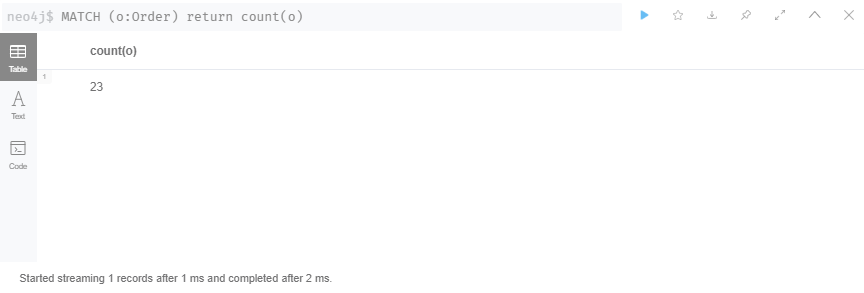
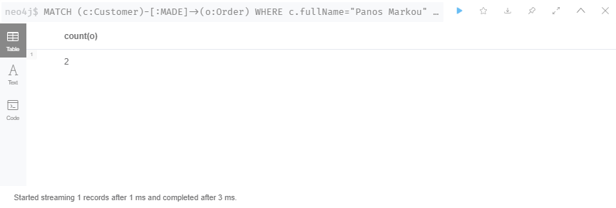
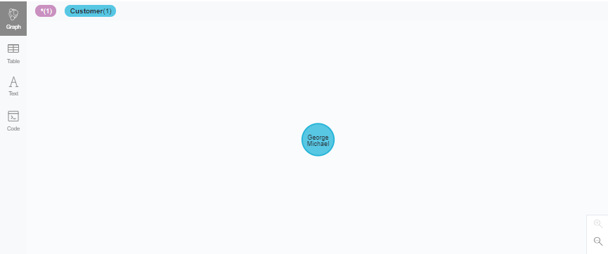
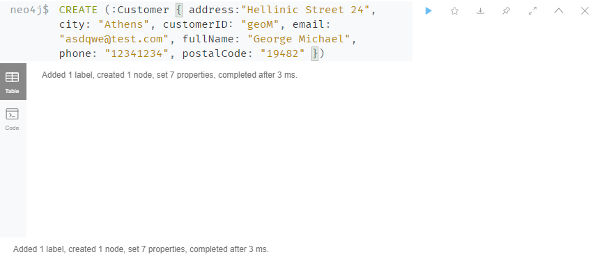
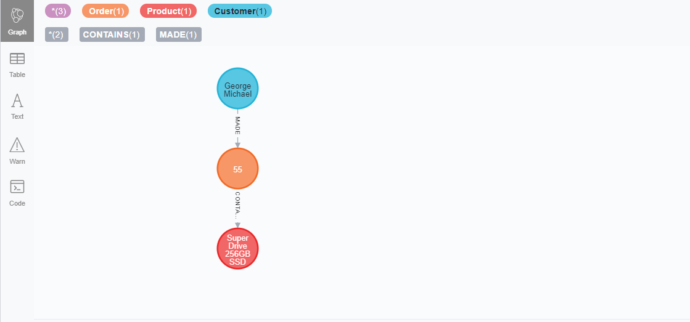
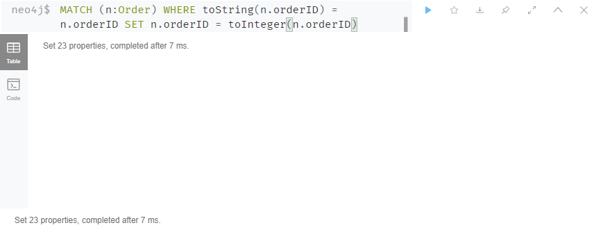
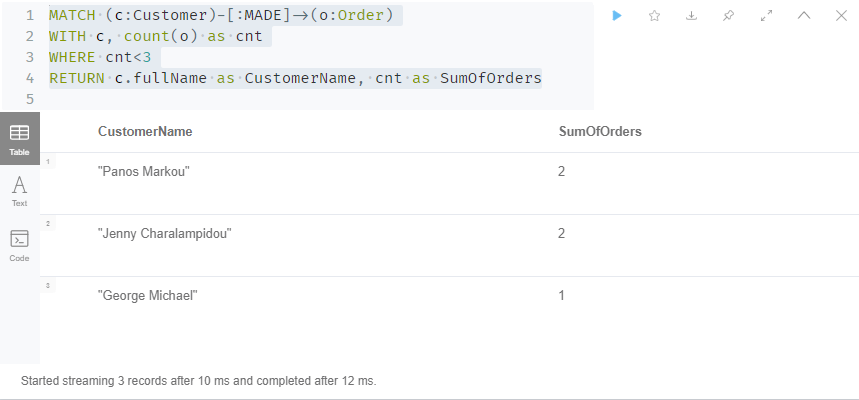
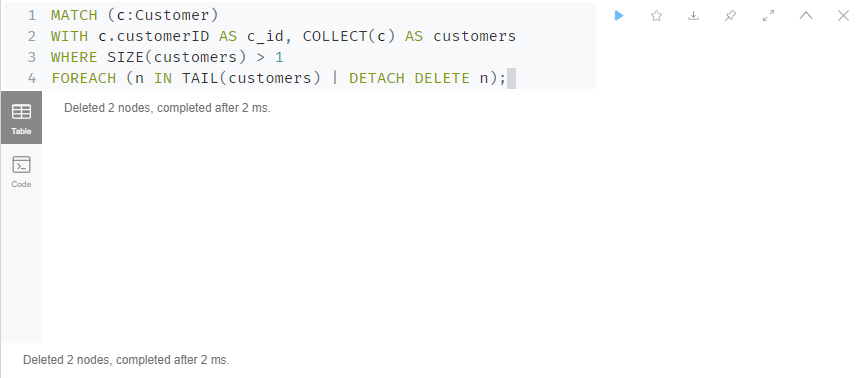

# GraphDataDBs 

The graph example contains a traditional retail-system with products, orders, customers, suppliers and employes.

# Nodes 

1. `User` : (or customer) Customers who order product from the shop
2. `Order` : Sales order transaction taking place between the customer and the shop
3. `Product` : Product information
4. `Category` : All the products are listing according to their type of usage
5. `Supplier` : Suppliers of the product

Nodes are imported from a specific CSV files for each node. Furthermore, in all CSV files have implemented additional info for each node as 

# Relationships

1. `(:User)-[:MADE]->(:Order)`
2. `(:Order)-[:CONTAINS]->(:Product)`
3. `(:Product)-[:PART_OF]->(:Category)`
4. `(:Product)-[:SUPPLIED]->(:Supplier)`

# Database Import

Using cypher-shell (terminal):

`cat script.cypher| cypher-shell -u <username> -p <password>`

Or run `script.cypher` on neo4j Desktop app. (recommened)

# Examples

You can trigger the script below only when you have successfully implemented the dataset into the neo4j broswer.

1. Get the total ammount of orders:

	`MATCH (o:Order) return count(o)`

2. Get the total ammount of orders from a specific Customer:

	`MATCH (c:Customer)-[:MADE]->(o:Order) WHERE c.fullName="Panos Markou" RETURN count(o)`

3. Create a new user named George Michael:

	`CREATE (:Customer {
    address:"Hellinic Street 24",
    city: "Athens",
    customerID: "geoM",
    email: "asdqwe@test.com",
    fullName: "George Michael",
    phone: "12341234",
    postalCode: "19482" })`

4. Create yet another order na make the relationship with the user:

	`MATCH (c:Customer)
	WHERE c.fullName="George Michael"
	CREATE (:Order {shipCity: "Heraklion",
	quantity: "5",
	productID: "23",
	deliveryMethod: "Shipping",
	orderID: "55",
	discount: "0",
	requiredDate: "2021-08-01",
	shipPostalCode: "12345",
	shipAddress: "Methodiou 12",
	customerID: c.customerID,
	shippedDate: "2021-07-22",
	orderDate: "2021-07-02"})<-[:MADE]-(c)`

5. Create relationship between a specific Order (orderId=55) and specific product (productID=23)

	`MATCH (o:Order), (p:Product) 
	WHERE o.orderID="55" AND o.productID=p.productID
		CREATE (o)-[:CONTAINS]->(p) 
	RETURN o`

6. Change the type of the orderID (String to Integer)

	`MATCH (n:Order)
	WHERE toString(n.orderID) = n.orderID
	SET n.orderID = toInteger(n.orderID)`

7. Find the Customer with up to 3 orders
	
	`MATCH (c:Customer)-[:MADE]->(o:Order)
	WITH c, count(o) as cnt
	RETURN c.fullName as CustomerName, cnt as SumOfOrders
	WHERE cnt<3
	`

8. Delete all but one of the dublicated customers in our graph (i.e we have accidentaly created 2 more users with the same properties)
	
	`MATCH (c:Customer)
WITH c.customerID AS c_id, COLLECT(c) AS customers
WHERE SIZE(customers) > 1
FOREACH (n IN TAIL(customers) | DETACH DELETE n);`

## Possible problems you could encounter

In case that you have problems with the indexes that have not removed after a graph cleaning you sould use the following script:

`DROP CONSTRAINT
ON (n:Order)
ASSERT n.orderID IS UNIQUE`

`DROP INDEX ON :Customer(customerID)`

`DROP INDEX ON :Category(categoryID)`

`DROP INDEX ON :Supplier(supplierID)`

`DROP INDEX ON :Product(productName)` 

Questions? [Please do not hesitate to ask me ( manoskoutoulak@gmai.com )]

 